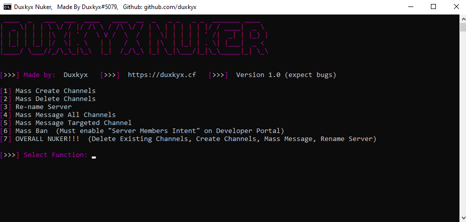

# Duxkyx Nuker

A Discord tool with 7 features. This is my first proper Python project (evidently shown by my hideous code), if you would like to leave feedback it would be greatly appreciated, if this goes well I might decide to add more too it.

```bash
  • Mass Ban.
  • Delete all channels.
  • Mass create channels.
  • Re-name Server.
  • Mass message all channels.
  • Mass message targeted channel.
  • Overall Nuker! (all features besides ban)
```


## Installation

Click the green code button above and install, everything is open sourced but feel free to run through virus total.

```bash
  #1: Once downloaded extract to a folder.
  #2: Run the setup.bat to install all libraries used.
  #3: Run start.bat and enjoy!

  If you decide to take some of my crappy code please credit.

```
    
## Authors

- [@Duxkyx](https://www.github.com/duxkyx)


## Feedback

As stated above, this is my first proper Python project and with that will come many errors and bugs, if you have anything worth mentioning please reach out to my Discord: Duxkyx#5079

